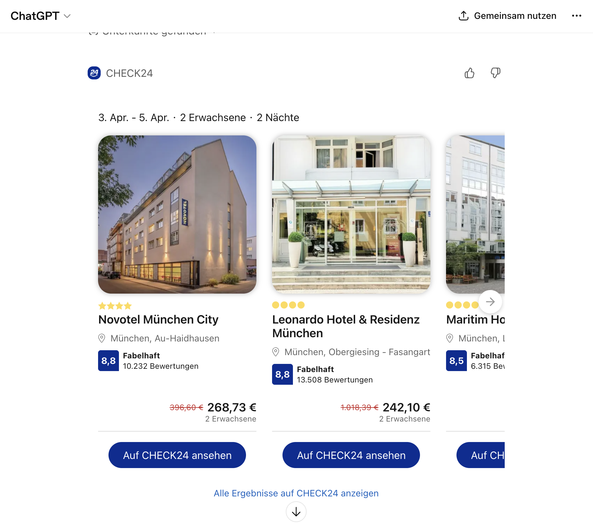

# CHECK24 ChatGPT App Challenge

**Note:** This is the challenge for the **9th round** of the [GenDev Scholarship](https://www.talents.check24.de/gendev). Applications are open until **May 17th, 2026** - the program kicks off at the end of June. We're looking forward to your application! 🤓

# Table of Contents

<!-- TOC -->
* [The Challenge 🤔](#the-challenge)
* [Problem Details 🔍](#problem-details)
  * [ChatGPT-conformant tools](#chatgpt-conformant-tools)
  * [Versioning](#versioning)
  * [Per-vertical testing through the proxy](#per-vertical-testing-through-the-proxy)
  * [Mock vertical MCPs](#mock-vertical-mcps)
  * [Out of scope](#out-of-scope)
* [Your submission](#your-submission)
  * [What you must deliver](#what-you-must-deliver)
  * [Optional features ✨](#optional-features)
  * [How to hand in your application 🚀](#how-to-hand-in-your-application-)
* [What we're evaluating](#what-were-evaluating)
* [Questions?](#questions)
* [Resources 📚](#resources)
<!-- TOC -->

# The Challenge

With the Apps SDK, OpenAI enables companies to expose their services to customers from inside ChatGPT.
Here you can see how a hotel search inside ChatGPT via Check24 can look like:

CHECK24 consists of many **independent** comparison products (**verticals**), but customers see **one** brand - the same tension already solved by the **website and native apps**. **ChatGPT** now does it again: the host expects **one** MCP connector, while in practice each vertical **owns** its own MCP server.
From the customer perspective, requests often start with a life situation or goal rather than a clearly chosen product. A single conversation may therefore naturally touch multiple products instead of mapping cleanly to one vertical from the start - which in practice can lead to ambiguity, routing challenges, or the need for hand-offs across products.

**Your job:** Build a **proxy MCP** - exactly one ChatGPT-facing endpoint, with all vertical MCPs only behind it (never registered directly with ChatGPT).

# Problem Details 🔍

## ChatGPT-conformant tools

What the proxy exposes **to ChatGPT** must **conform to** how ChatGPT and the **Apps SDK** expect MCP tools and resources to look and behave. **Reading OpenAI’s documentation yourself is part of the challenge** - we do not reproduce the rules in this README. Use the official material as your source of truth, e.g. the [Apps SDK quickstart](https://developers.openai.com/apps-sdk/quickstart) and the linked concepts (MCP server, tools, resources, optional UI).

Vertical MCPs may define tools however they like internally; your job is to decide what may surface on the **ChatGPT-facing** MCP and what must be **filtered, adapted, or withheld**.

That gatekeeping is not silent: the **proxy must give vertical teams actionable feedback** when their tools or resources are **not** acceptable for exposure as-is against **OpenAI’s Apps SDK / MCP expectations**, unsafe to forward, withheld, or in need of adaptation (see **[Feedback to verticals](#what-you-must-deliver)** under *What you must deliver*). Teams should be able to **act** on what you report, not guess why something disappeared from the aggregated surface.

## Versioning

Your solution will not stay fixed over time, and neither will the vertical MCPs behind it. Implement a **versioning concept** and the **trade-offs** you accept.
When you ship a new version, what changes - and who has to do the work?

That question also sits in a **product reality**: a **listed, official** ChatGPT app is **registered** with OpenAI and goes through **review**. Approval covers the app **as it was at that moment** - not a blank cheque to change tools, data handling, or UX without limit afterward. **Any changes** may require **another** path through review or policy, so **stability** and explicit **versioning** are not only technical niceties. For this scholarship you will usually use **developer/connector** mode; still, factor the above into how you think about **lifecycle** and what the proxy exposes over time.

## Per-vertical testing through the proxy

In reality, a vertical team needs to check **its** tools and resources **inside ChatGPT**-end-to-end through the same Apps SDK / MCP path customers use - **without** every other vertical’s tools appearing in the same session. ChatGPT still attaches to **one** connector URL, so the **proxy** is the natural place to offer a **scoped** view (e.g. only one vertical’s aggregated surface) for QA and sign-off, next to the **full** merged catalog you use for the “whole CHECK24” experience.

Think about how a team could run that **isolated** pass through the proxy (configuration, separate deployment, header, or another mechanism you justify) - not by registering their MCP with ChatGPT directly.

## Mock vertical MCPs

**Building your own small MCP servers** that **represent** the verticals is **part of the challenge** - that is how you show how the proxy behaves when several independent MCPs sit behind a single ChatGPT-facing entry point.

Treat those servers as **mocks**: you **do not** need real product logic, live inventory, or genuine CHECK24 journeys. **Stub tools**, placeholder responses, and minimal implementations are enough, as long as the MCP surface is credible and reviewers can follow **proxy** concerns (aggregation, conformance, routing, versioning, feedback, and so on).

## Out of scope

To keep the challenge focused, some topics are **explicitly out of scope** or should receive only limited attention:

- **Authentication in ChatGPT via OAuth is completely out of scope.** You do not need to implement or demonstrate a ChatGPT OAuth flow for this challenge.
- **Perfect widget design is not the main focus.** If you build custom UI elements, treat them as an optional enhancement, not as the center of your submission.

**Security still matters as part of the overall system design.** We do not expect a production-grade security program in a student challenge, but we do expect that you think about the topic and document relevant considerations, trade-offs, and risks. This can include tool exposure, input validation, trust boundaries between proxy and vertical MCPs, secrets handling, or what you would harden next in a real rollout. Be prepared to discuss those decisions in later interviews.

We care most about the **proxy architecture**, **MCP aggregation**, **routing**, **conformance**, **versioning**, and the overall technical quality of your solution.

# Your submission

What we **require** and **optionally** reward in your repo, plus **how to hand it in** (see also **[What we're evaluating](#what-were-evaluating)**).

## What you must deliver

- **Single ChatGPT-facing proxy MCP:** Aggregate into **exactly one** MCP endpoint for ChatGPT. Expose **only** tools and resources that comply with the **Apps SDK / MCP** expectations - ground your implementation in OpenAI’s docs, starting from the [Apps SDK quickstart](https://developers.openai.com/apps-sdk/quickstart).
- **Vertical MCPs (mocked):** Run **one MCP server per vertical** so ownership matches reality: each vertical defines its own tools and schemas. ChatGPT must connect **only** to the proxy, never to those backends directly.
- **Versioning:** Provide a clear **versioning concept** for how the proxy and vertical MCPs evolve together - especially [when you ship a new version, what changes, and who does the work](#versioning).
- **Feedback to verticals:** The **proxy** must give vertical teams **actionable feedback** on their tools when something is nonconforming, unsafe to forward, withheld, or needs adaptation.

## Optional features ✨

This is where your submission can **stand out**: show **creativity**, depth, and empathy for **vertical teams** and operators. We have no fixed checklist for “the best” idea; surprise us with **tools**, **CLIs**, **dashboards**, **dry-runs**, **docs generators**, **local dev stacks**, or anything else that makes the ChatGPT proxy ecosystem easier to build and improve.

The sections below are **starting points** only. You can pursue one, several, none, or replace them entirely with your own concepts.

### Cross-vertical tool ambiguity

Several CHECK24 verticals sit in related domains and may expose tools whose **names or descriptions look alike**, even though they serve **different products and user intents**. Tool names and schemas stay **owned by each vertical**; the proxy cannot assume a single global naming scheme.

**Example:** *Pauschalreise* (package holidays) and *Flug* (flights) are separate verticals. Each might expose something like `searchFlight`. A user asking about **Pauschalreise** should reach **that** vertical’s tool - not *Flug’s*. A flat merged tool list makes it easy for the model to **pick the wrong vertical**.

We look for a **credible, best-effort** mitigation (routing, namespacing, metadata, gating, or your own idea), **honest** limits, and respect for vertical-owned naming. This **probably cannot** be avoided **100%** of the time.

### Tracing and monitoring

Give operators visibility into **incoming requests or sessions**: correlation IDs, latency, errors **per vertical**, or other signals that make debugging the proxy and its backends tractable.

### Health dashboards

Surface **reachability**, error rates, latency, recent failures, or **conformance status** for the proxy and/or each vertical MCP - whatever helps teams answer “is my side green?” quickly.

### Conversation- and session-level insights

Show how users interact with the app across one conversation and how often each tool is called. (You will find a hint on how to correlate a conversation in the OpenAI documentation.)

### Sandbox for widgets

Let verticals or integrators **try** widgets in isolation before changes hit the aggregated, customer-facing surface, to provide a quicker feedback loop.

This is about **developer workflow and integration testing**, not about designing a perfectly styled widget UI. If you build widgets, focus on how they fit into the proxy ecosystem and how teams can validate them safely.

## How to hand in your application 🚀

- Your application should include **all required items below**.

- **Video (max. 5 minutes):**
  - Present the **core features** you built into the proxy, both required **and** optional.
  - Explain your **technical concept and setup**: architecture, key design decisions, routing/conformance strategy, and how reviewers should think about the system. Do not limit the video to a UI walkthrough.
  - Link the video in your GitHub repository README.

- **Deployment:**
  - The **ChatGPT-facing proxy MCP** must be **publicly reachable** so reviewers can attach it in ChatGPT or exercise it with the [MCP Inspector](https://modelcontextprotocol.io/docs/tools/inspector).
  - Reviewers should **not** have to start your system locally via Docker Compose or other setup just to see the core functionality. The shipped review surface should already be deployed somewhere reachable.
  - The **aggregator / proxy MCP should be public for review**. The **vertical MCPs should stay behind it** and do **not** need to be publicly exposed.
  - If you implemented any other features (dashboards, management UI, tracing views, widgets, etc.), reviewers must be able to **see them in action** - not only read a description. Link the URL(s) and any connector steps in your README.

- **Repository & Documentation:**
  - Submit your work in a **private GitHub repository**.
  - Include your **code and documentation as README** within the repository.
  - Invite the GitHub account **gendev@check24.de** for review access.
  - When you hand in your application, include the link to your GitHub repository.

# What we're evaluating

Beyond the functional bar in **[What you must deliver](#what-you-must-deliver)**, we score submissions much like **earlier GenDev rounds**: we want **clean, convincing engineering**, not a single flashy demo.

- **Code quality:** Readable, maintainable code; sensible modules and naming; no needless complexity.
- **Documentation:** A root **README** (and extra Markdown if it helps) that explains your approach.
- **Architecture & software design:** A coherent split of responsibilities in the proxy (aggregation, routing, conformance checks, feedback paths) and honest handling of failures or skew between verticals. **Separation of concerns** counts: keep **ChatGPT / Apps SDK–specific** glue separate from **generic MCP aggregation and routing**, so another MCP-capable host (e.g. Claude) could reuse the core later - good structure and that extensibility goal go together.
- **Creativity:** Your own creative ideas or features from the [Optional features](#optional-features) section.
- **Deployment & reproducibility:** The **ChatGPT-facing MCP** (and any other feature you ship) should be **reachable** for review.

# Questions?

Have questions about the GenDev application process? Check out our [FAQ](https://www.talents.check24.de/en/gendev-faq).

If you still have more specific questions, feel free to contact us at gendev@check24.de.

# Resources 📚

- **OpenAI Apps SDK:** [Documentation](https://developers.openai.com/apps-sdk/) · [Quickstart](https://developers.openai.com/apps-sdk/quickstart)
- **MCP Inspector** (debugging MCP servers): [Guide](https://modelcontextprotocol.io/docs/tools/inspector) · [GitHub](https://github.com/modelcontextprotocol/inspector)
- **MCP specification:** [Model Context Protocol specification (latest)](https://modelcontextprotocol.io/specification/latest/)
